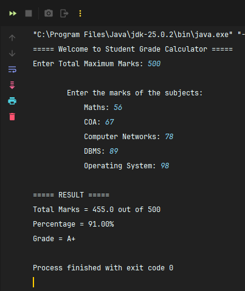

<div align="center">

# CODSOFT Java Programming Internship


### Virtual Internship in Java Programming

**Duration:** 25 May 2026 – 25 June 2026  
**Batch:** MAY BATCH C2  
**Intern ID:** BY25RY294529

---

*"Transforming concepts into code through hands-on Java projects."*

</div>

---

---

##  About the Internship

This repository contains the projects completed during my **CODSOFT Virtual Internship in Java Programming**. The internship focused on strengthening core Java concepts through practical tasks and problem-solving.

Throughout this internship, I explored topics such as:

* Object-Oriented Programming (OOP)
* User Input Handling
* Conditional Statements
* Loops and Iterations
* Java Utility Classes
* Console-Based Application Development

---

#  Completed Tasks

## 🎯 Task 1: Number Guessing Game

###  Description

A fun console-based game where the program generates a random number, and the user attempts to guess it.

###  Features

*  Random number generation between 1–100
*  User input using Scanner
*  Feedback for guesses:

  * Too High
  * Too Low
  * Correct Guess
*  Multiple attempts
*  Displays total attempts taken

###  Technologies Used

* Java
* IntelliJ IDEA
* Scanner Class
* Random Class

###  Concepts Learned

* Classes and Objects
* Loops
* Conditional Statements
* Methods
* Random Number Generation

###  Output

<p align="center">
  
  
  
</p>

---

## 📊 Task 2: Student Grade Calculator

###  Description

A console-based application that calculates the total marks, percentage, and grade of a student based on marks entered by the user.

###  Features

*  Accepts marks for multiple subjects
*  Calculates total marks
*  Computes percentage
*  Assigns grades based on performance
*  Displays complete result summary

### 🛠 Technologies Used

* Java
* IntelliJ IDEA
* Scanner Class

###  Concepts Learned

* User Input Handling
* Arithmetic Operations
* Decision Making
* Grade Calculation Logic

###  Output

<p align="center">
  
</p>

---

## 🏧 Task 3: ATM Interface (Mini Banking System)

###  Description

A console-based ATM simulation that allows users to create multiple bank accounts, securely log in using their account credentials, and perform various banking operations. To enhance the functionality, file handling was implemented to preserve account data even after the application is closed.

###  Features

* 👤 Create Multiple Bank Accounts
* 🏦 Automatically Generates Unique 6-Digit Account Numbers
* 🔐 Secure Login using 4-Digit PIN
* 💰 Opening Balance Setup During Account Creation
* 📊 Check Current Account Balance
* 💵 Deposit Money
* 💸 Withdraw Money with Insufficient Balance Validation
* 🔓 Logout Functionality
* 🚪 Exit System Safely
* 💾 Persistent Data Storage using `accounts.txt`
* 🔄 Automatically Loads Existing Accounts on Restart

###  Technologies Used

* Java
* IntelliJ IDEA
* Scanner Class
* ArrayList
* Random Class
* File Handling (`BufferedReader`, `BufferedWriter`)
* OOP Concepts

###  Concepts Learned

* Classes and Objects
* Encapsulation
* Constructors
* ArrayList Collections
* Authentication Logic
* File Handling
* Exception Handling
* Menu-Driven Programming
* Data Persistence

###  Output

<p align="center">
  
  
  
  
</p>

<br>

<h4 align="center"> Account Data Storage</h4>

<p align="center">
  
</p>

###  Sample Workflow

```text
Create Account
       ↓
Enter Name, 4-Digit PIN and Opening Balance
       ↓
Unique 6-Digit Account Number Generated
       ↓
Account Saved to accounts.txt
       ↓
Login Using Account Number + PIN
       ↓
Check Balance / Deposit / Withdraw
       ↓
Logout
       ↓
Restart Application
       ↓
Previously Created Accounts Are Automatically Loaded
```

---

## 🧑‍🎓 Task 4: Student Management System

### Description

A console-based Student Management System developed using Java to manage student records efficiently. The application allows users to perform CRUD (Create, Read, Update, Delete) operations on student data through a menu-driven interface. File handling was implemented to ensure that student records persist even after the application is closed.

### Features

* ➕ Add New Student Records
* 📋 Display All Students
* 🔍 Search Students Using Roll Number
* ✏️ Update Existing Student Details
* 🗑️ Remove Student Records
* 💾 Save Student Data to `students.txt`
* 🔄 Automatically Load Existing Records on Restart
* 🚪 Exit Application Safely
* 📌 Console-Based Menu Interface

### Technologies Used

* Java
* IntelliJ IDEA
* Scanner Class
* ArrayList
* File Handling (`BufferedReader`, `BufferedWriter`)
* OOP Concepts
* Exception Handling

### Concepts Learned

* Classes and Objects
* Encapsulation
* Constructors
* ArrayList Collections
* CRUD Operations
* File Handling
* Exception Handling
* Menu-Driven Programming
* Data Persistence

### Output

<p align="center">
  
  
  
  <br><br>

  
  
  
  <br><br>

  
  
  
</p>

<br>

<h4 align="center">Student Data Storage</h4>

<p align="center">
  
</p>

### Sample Workflow

```text
Start Application
       ↓
Load Existing Student Records
       ↓
Display Main Menu
       ↓
Add / Search / Update / Remove Students
       ↓
Display Student Records
       ↓
Save Records to students.txt
       ↓
Exit Application
       ↓
Restart Application
       ↓
Previously Saved Student Data Is Automatically Loaded
```
---

#  Tools & Technologies

<div align="center">

| Technology            | Purpose                  |
| --------------------- | ------------------------ |
| ☕ Java               | Programming Language     |
| 💻 IntelliJ IDEA      | IDE                      |
| 📝 Scanner            | User Input               |
| 🎲 Random             | Random Number Generation |
| 📚 ArrayList          | Dynamic Data Storage     |
| 💾 File Handling      | Persistent Data Storage  |
| ⚠️ Exception Handling | Error Management         |
| 🏛️ OOP Concepts       | Code Organization        |


</div>

---

# 🌱 Learning Outcome

This internship provided valuable hands-on experience in building console-based Java applications and strengthened my understanding of core programming concepts.

Through these projects, I improved my skills in:

* Designing menu-driven applications
* Applying Object-Oriented Programming principles
* Managing user input and validations
* Implementing authentication mechanisms
* Working with collections such as ArrayList
* Persisting application data using file handling
* Developing structured and maintainable Java programs

These projects enhanced both my problem-solving abilities and confidence in developing practical Java applications.

---

<div align="center">

### ⭐ If you found this repository helpful, consider giving it a star!


</div>
